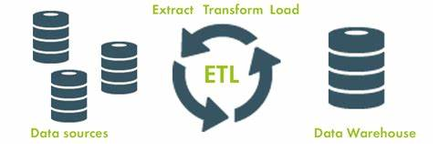

# Creation of a procurement database: Requisition and Purchasing Order information

## Background (company request with live data):
The purchasing and procurements department of a local company had been running their procurements process through a series of un-linked excel files, that were maintained and updated individually by two different employees.  In some cases, data was updated or duplicated in one file, but not updated with the same information in other files.  The process had become unwieldy, and the company suggested trying to use the original files to set up a database, which would facilitate addition of new entries in the future, while ensuring updates to all tables with any new information. 

The original project (including prior commit history) and the full final product is housed in the following [repository](https://github.com/paulobetoy/etl_project).

## Contents
* Jupyter notebook used to transform raw data using Python (Pandas library)
* PostGreSQL code used to generate the new table schema
* The final SQL database with transformed data loaded in
* Sample SQL queries used to test the newly created SQL database
* A pdf copy of the project's summary report, with additional recommendations to the company on purchase order processing

## Extract
The 5 original Excel files, which comprised the prior procurement tracking system and came directly from the company’s eProcurement tool, were converted to csv format:
* Approval data – tracking purchase order requests
* Exchange rates – tracking currency exchange rates, needed to convert prices/cost for orders to and from different countries
* Order header – tracking full, approved purchase orders as individual line items
* Order Line – tracking individual items within approved purchase orders, with each item as an individual entry
* STAR data – tracking codes for different characteristics attributed to purchase request items
Data was the loaded into python pandas library for data transformation and data cleaning. 

## Transform
Each of the files needed to be cleaned up: renaming column headers, eliminating unnecessary columns, and rearranging column order to prioritize key data first, and to provide a better sense of flow during data entry and revision. Two tables were particularly difficult to clean:

* APPROVAL DATA: The main challenge here was converting the date-time columns to a date-24h format and then to have Postgres accept the values of this conversion. In the end, it was decided to perform a second conversion of the date-24h back to string values in order to help Postgres to accept the information.

* ORDER LINES: In theory, every purchase order number in the order header table should have appeared in the order line table.  However, given that the two tables had been updated manually, and at times by separate employees, there were some purchase orders in the order line data that was missing from order header data. Since part of the project required linking the two tables using the purchase order number as a primary/foreign key, the main challenge was to identify and delete problematic values.  This was accomplished by performing an INNER JOIN in PostGres, with the resulting data saved as a new order line table (preserving the old, unaltered data in the old order line table), and exported back into pandas.

## Load
Loading was done through an engine linked directly to PostGres.  As mentioned above, an additional table called old_order_lines was created in order to preserve records that did not pass the quality control needed at the data transformation phase.  The company could then later investigate further the reason for inaccuracies in the data entries and take steps to update the data for inclusion in the new database.

## Test Queries
Once the new database scheme and populated with the cleaned data, the data was reloaded into pandas.  A couple test queries were run at the end of the jupyter notebook used for ETL, to confirm that the data had been loaded correctly and could be queried effectively. 

## Instructions for recreating the database
1. Extract and read source data from original CSVs (run Step 1 in jupyter notebook)
2. Create tables in PostgreSQL (run SQL schema file)
3. Transform, clean, & format data in Pandas. Export final dataframes into PostGres. (5 data frames total, run Step 3 in jupyter notebook)
4. Create any new dataframes needed for the final database and load into Postgres (Run the joins as stated below and explort the resulting table as a csv.  Load the csv back into Jupyter and run the rest Step 4)
    * In this case, we needed to create a new version of the order line table, done through performing an inner join in Postgres between the original (old) order line table and the order header table (run the ETL-querys file in PostGres and explort the results as a new csv file)
    * Load this new table in jupyter and finish data cleaning (run the left join and the rest of the data cleaning in Step 4, then load the new table back into PostGres)
5. Connect to the local database and load data back into jupyter via SQLAlchemy in order to run queries (run Steps 5 & 6 in jupyter notebook) 

